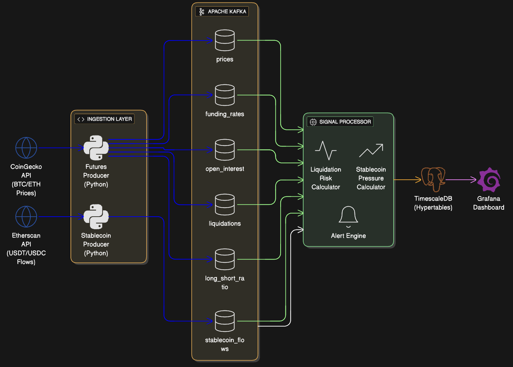
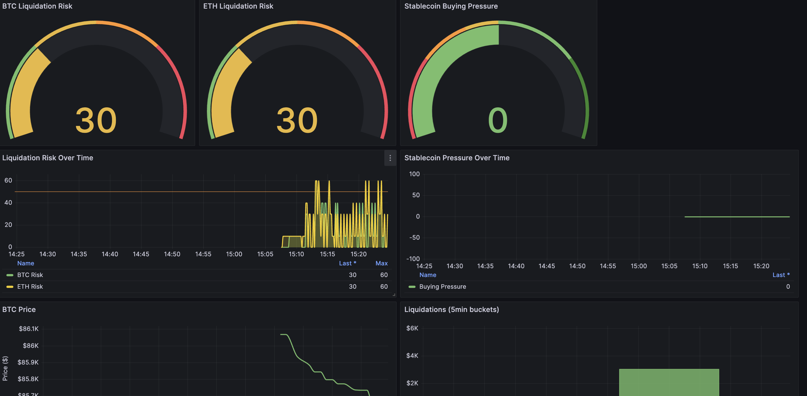

# Liquidation Cascade Monitor

A real-time crypto market intelligence system that predicts potential liquidation cascades by combining derivatives data with stablecoin flow analysis.



## What Does This Do?

Ever noticed how crypto markets can crash 10% in minutes? That's often a **liquidation cascade** - when leveraged traders get liquidated, their forced sells trigger more liquidations, creating a domino effect.

This project tries to detect these events *before* they happen by watching:

- **Funding rates** - High positive = too many longs, they'll get rekt on a dip
- **Open Interest changes** - Rising OI + flat price = overleveraged market
- **Long/Short ratios** - Extreme imbalance = reversal incoming
- **Stablecoin flows** - Big USDT deposits to exchanges often precede dumps

The system calculates two scores:
- **Liquidation Risk (0-100)** - How likely is a cascade?
- **Stablecoin Pressure (-100 to +100)** - Is smart money buying or selling?

When both signals align (high risk + negative pressure), you get an alert.

## Dashboard Preview



## Architecture

```
CoinGecko API ──→ Futures Producer ──→ Kafka ──→ Signal Processor ──→ TimescaleDB ──→ Grafana
Etherscan API ──→ Stablecoin Producer ──↗
```

**Stack:**
- **Data Sources**: CoinGecko (prices), Etherscan (stablecoin flows)
- **Message Queue**: Apache Kafka
- **Processing**: Python (custom signal processor)
- **Storage**: TimescaleDB (time-series PostgreSQL)
- **Visualization**: Grafana

## Quick Start

### Prerequisites

- Docker & Docker Compose
- Python 3.9+
- (Optional) Etherscan API key for stablecoin tracking

### 1. Clone and Start Infrastructure

```bash
git clone https://github.com/dharmateja03/liquidation-cascade-monitor.git
cd liquidation-cascade-monitor

# Start Kafka, TimescaleDB, Grafana
docker-compose up -d

# Wait for services to be ready
sleep 15

# Create Kafka topics
docker exec kafka kafka-topics --bootstrap-server localhost:9092 \
  --create --topic prices --partitions 3 --replication-factor 1 --if-not-exists

docker exec kafka kafka-topics --bootstrap-server localhost:9092 \
  --create --topic funding_rates --partitions 3 --replication-factor 1 --if-not-exists

docker exec kafka kafka-topics --bootstrap-server localhost:9092 \
  --create --topic open_interest --partitions 3 --replication-factor 1 --if-not-exists

docker exec kafka kafka-topics --bootstrap-server localhost:9092 \
  --create --topic liquidations --partitions 3 --replication-factor 1 --if-not-exists

docker exec kafka kafka-topics --bootstrap-server localhost:9092 \
  --create --topic long_short_ratio --partitions 3 --replication-factor 1 --if-not-exists

docker exec kafka kafka-topics --bootstrap-server localhost:9092 \
  --create --topic stablecoin_flows --partitions 3 --replication-factor 1 --if-not-exists
```

### 2. Install Python Dependencies

```bash
cd producers
pip install -r requirements.txt
```

### 3. Start the Producers

**Terminal 1 - Data Producer:**
```bash
python binance_futures_producer.py
```

**Terminal 2 - Signal Processor:**
```bash
python signal_processor.py
```

**Terminal 3 (Optional) - Stablecoin Tracker:**
```bash
# Edit stablecoin_producer.py and add your Etherscan API key first
python stablecoin_producer.py
```

### 4. Open Grafana

Go to [http://localhost:3000](http://localhost:3000)

- **Username**: admin
- **Password**: admin

Navigate to Dashboards → "Liquidation Cascade Monitor"

## How the Scoring Works

### Liquidation Risk Score (0-100)

| Component | Points | Trigger |
|-----------|--------|---------|
| Funding Rate | 0-30 | High positive funding = overleveraged longs |
| OI Change | 0-30 | Rising OI without price movement = danger |
| Long/Short Ratio | 0-20 | Extreme imbalance either way |
| Recent Liquidations | 0-20 | Cascade already starting? |

### Stablecoin Pressure Score (-100 to +100)

| Signal | Meaning |
|--------|---------|
| Positive (+) | Net outflows from exchanges = accumulation (bullish) |
| Negative (-) | Net inflows to exchanges = distribution (bearish) |

### Alert Levels

| Severity | Condition |
|----------|-----------|
| CRITICAL | Liq Risk > 70 AND Stablecoin Pressure < -30 |
| WARNING | Liq Risk > 50 AND Stablecoin Pressure < 0 |
| INFO | Liq Risk > 30 |

## Project Structure

```
liquidation-cascade-monitor/
├── docker-compose.yml          # Infrastructure setup
├── start.sh                    # One-click startup script
├── config/
│   └── init.sql                # TimescaleDB schema
├── producers/
│   ├── requirements.txt
│   ├── binance_futures_producer.py   # Price & derivatives data
│   ├── stablecoin_producer.py        # On-chain stablecoin flows
│   └── signal_processor.py           # Risk calculation engine
├── grafana/
│   └── provisioning/
│       ├── datasources/
│       │   └── datasources.yml
│       └── dashboards/
│           ├── dashboards.yml
│           └── liquidation_cascade.json
└── docs/
    ├── architecture.png
    └── grafana-dashboard.png
```

## Services & Ports

| Service | Port | URL |
|---------|------|-----|
| Grafana | 3000 | http://localhost:3000 |
| Kafka UI | 8080 | http://localhost:8080 |
| Kafka | 9092 | localhost:9092 |
| TimescaleDB | 5432 | localhost:5432 |
| Flink UI | 8081 | http://localhost:8081 |

## Data Sources

| Source | Data | Update Frequency | API Key Required |
|--------|------|------------------|------------------|
| CoinGecko | BTC/ETH prices, volume | 10 seconds | No (free tier) |
| Etherscan | USDT/USDC transfers | 15 seconds | Yes (free tier available) |

## Limitations & Future Work

**Current Limitations:**
- Binance Futures API is geo-restricted (US). Using simulated derivatives data based on spot price movements.
- Stablecoin tracking requires Etherscan API key
- Only tracking BTC and ETH currently

**Ideas for Improvement:**
- Add more exchanges (Bybit, OKX, dYdX)
- Real liquidation data from exchanges with global access
- ML model for cascade prediction
- Telegram/Discord alerts
- Historical backtesting to validate signals

## Troubleshooting

**Kafka not starting?**
```bash
docker-compose down -v
docker-compose up -d
```


**No data in Grafana?**
1. Make sure producers are running
2. Check Kafka UI at http://localhost:8080 to see if messages are flowing
3. Verify TimescaleDB has data:
```bash
docker exec timescaledb psql -U postgres -d crypto_signals -c "SELECT COUNT(*) FROM prices;"
```


## License

MIT - Do whatever you want with it.

---

*Built for learning Kafka, stream processing, and crypto market microstructure. Not financial advice. Don't trade based on this.*
*This file is built with AI*
